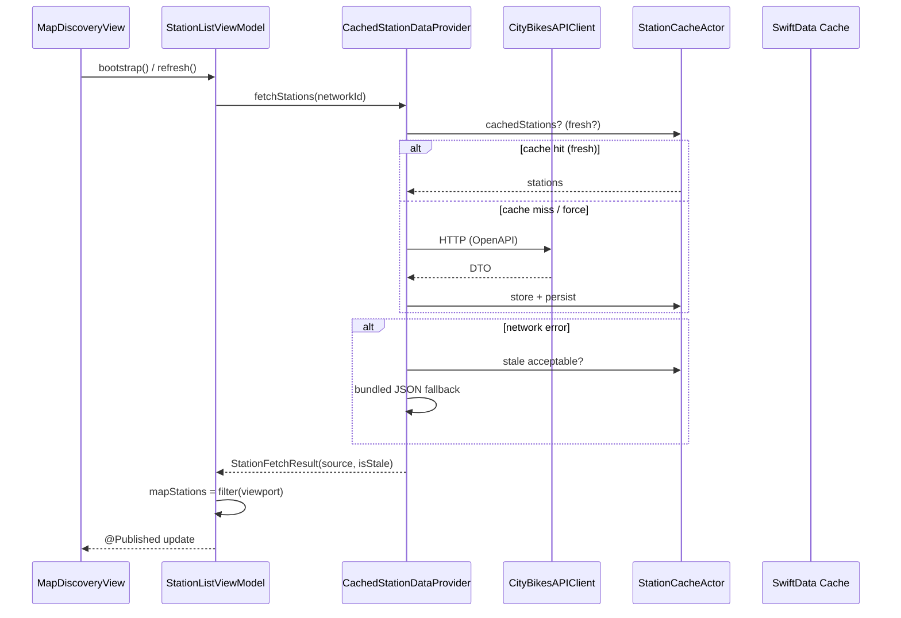

# Urban Mobility Explorer

**地图优先的城市微出行探索器 —— 在一张地图上读懂整座城市的共享单车脉搏。**

**Repository:** [github.com/NewtDean/UrbanMobilityExplorer](https://github.com/NewtDean/UrbanMobilityExplorer)


零 API Key · 离线可审 · 分层缓存 · 可测试架构 · 生产级地图 Sheet 编排

## 目录

- [运行截图](#运行截图)
- [这是什么](#这是什么)
- [为什么值得看](#为什么值得看)
- [功能全景](#功能全景)
- [设计思路](#设计思路)
- [系统架构](#系统架构)
- [数据与韧性](#数据与韧性)
- [地图与 Sheet 体验](#地图与-sheet-体验)
- [领域能力](#领域能力)
- [工程结构](#工程结构)
- [技术栈](#技术栈)
- [快速开始](#快速开始)
- [测试](#测试)
- [OpenAPI 客户端生成](#openapi-客户端生成)
- [设计文档（设计先行）](#设计文档设计先行)
- [AI 开发规范（Cursor Skills）](#ai-开发规范cursor-skills)
- [架构决策记录](#架构决策记录)
- [权衡与边界](#权衡与边界)
- [路线图](#路线图)
- [项目不足与后续改进](#项目不足与后续改进)
- [致谢与许可](#致谢与许可)

---

## 运行截图

| 主页面 | 浏览网点 |
| :---: | :---: |
|  |  |
| 网点详情 | 城市选择 |
|  |  |
| 缩放地图 | 收藏的网点 |
|  |  |

---

## 这是什么

**Urban Mobility Explorer** 是一款以 **地图发现（Map-first Discovery）** 为核心的 iOS 原生应用。用户打开 App 即进入全屏 MapKit 地图，底部常驻 **Discovery Sheet** 作为城市微出行的控制中枢：浏览站点、收藏夹、站点详情、城市切换 —— 全部在 **同一张地图上下文** 中完成，无需 Tab 来回跳转。

应用对接全球 **CityBikes** 开放数据（共享单车/滑板车网络实时余量），并叠加 **Open-Meteo** 无密钥天气，在发现卡片上给出 **WMO 天气码 → 骑行建议** 的可读转化。底层采用 **协议驱动 + 装饰器缓存 + Actor 并发隔离 + SwiftData 持久化** 的分层设计，满足生产级要求：**可测、弱网可用、可扩展数据源**。

> 一句话：**不是「列表 App 附带地图」，而是「地图 App 附带可编排的 Bottom Sheet 工作流」。**

### 项目完成说明

| 项 | 说明 |
|----|------|
| **完成时间** | 2026 年 5 月 |
| **总用时** | 约 **8 小时** |
| **方案与架构** | 约 1 小时（产品范围、模块划分、ADR / 设计文档） |
| **UI 与交互** | 约 3 小时（SwiftUI 界面、Sheet 编排、地图相机与 Pin 视口联调） |
| **其余工程** | 约 4 小时（数据层、OpenAPI 客户端、缓存与网络集成、单元测试与缺陷修复） |

> 后期时间主要投入在 **UI 打磨** 与 **交互 / 地图视口类 Bug** 的排查修复；核心业务链路可在上述周期内跑通，但代码与体验仍有明确改进空间（见文末 [项目不足与后续改进](#项目不足与后续改进)）。

---

## 为什么值得看

| 维度 | 做法 |
|------|------|
| **交互范式** | 单屏地图 + 多层 Sheet 栈（发现 → 列表/收藏/详情/选城），FAB 与相机联动，避免传统 Master-Detail 割裂感 |
| **数据韧性** | `Live → Actor 内存缓存 → SwiftData 区域查询 → Bundled JSON` 四级降级，弱网/断网仍可演示 |
| **并发模型** | Swift 6 `Sendable` 领域模型 + `StationCacheActor` + `Task` 取消，ViewModel 留在 `@MainActor` |
| **网络层** | 独立 Swift Package `UrbanMobilityNetworking`，OpenAPI Generator 产出 Swift 6 + Alamofire 客户端 |
| **可测试性** | 14 个单元测试文件，覆盖推荐引擎、地理工具、缓存装饰器、SwiftData 收藏、DTO 映射 |
| **零密钥运维** | CityBikes + Open-Meteo 均无需注册 API Key，Clone 即用 |

---

## 功能全景

### 地图发现（核心路径）

- **全屏 MapKit 地图**：支持平移与捏合缩放（`.pan` + `.zoom`），站点 Pin 与选中态高亮
- **常驻 Discovery Sheet**（固定高度 ~350pt）：问候语、**Bike Stations** / **Your Favorite** 双入口卡片
- **城市天气条**：基于 Open-Meteo 当前天气；WMO Code 映射 SF Symbol + 英文骑行建议；切换城市时 Loading 占位
- **定位 FAB**：智能区分 **Current location（GPS）** 与 **已选城市 Hub**；相机 framing 带 Sheet 安全区与屏幕偏移校正
- **顶栏 MapTopBar**：城市名 + 网络名居中展示，一键进入城市选择器

### 站点浏览与详情

- **Station Browse Sheet**：可拖拽 Detent（半屏 / 全屏）；搜索（250ms 防抖）、排序（最近 / 推荐 / 名称）、筛选（有车 / 有空桩 / 仅收藏）
- **站点详情**：余量、地址、星级推荐分、收藏切换、Apple Maps 步行导航
- **地图联动**：列表选站后 **不 dismiss Sheet**（避免 `onChange` 误清空选中态）；地图 Pin 与详情面板同步

### 收藏与城市

- **SwiftData 收藏**：`FavoriteStation` / `FavoriteNetwork` 快照持久化，跨启动保留
- **收藏列表 Sheet**：与浏览列表一致的 Sheet 体验
- **城市选择器**：Bundled `networks.json` 全球城市目录 + **Current location** 行；逆地理解析设备所在城市
- **城市锚点语义**：选定城市后，距离计算、步行路线起点、天气锚点、FAB 回中心均使用 **城市 Hub**；仅 Current location 使用 GPS

### 推荐与展示

- **`StationRecommendationEngine`**：0–100 启发式评分（余量 40% + 车桩平衡 20% + 距离 25%），无外部 AI API
- **星级展示**：推荐分映射 1–5 星，详情与列表一致
- **站点身份**：`favoriteKey` = `networkId + stationId`，跨网络不冲突

### 启动与反馈

- **并行 Bootstrap**：定位授权、网络目录、最近网络匹配、首屏站点加载可并行；`ProgressHUD` 全局加载反馈
- **数据源标识**：UI 可感知 `live` / `cache` / `bundled` 与 `isStale` 状态

---

## 设计思路

### 1. Map-first，Sheet 作为「导航栈」

传统 Tab（地图 | 列表 | 收藏）会把 **空间上下文** 打碎。本产品选择：

```
地图（永远在场）
  └── Discovery Sheet（入口，不可下滑关闭）
        └── Stacked Sheet（列表 / 收藏 / 详情 / 选城）
```

**设计收益**：
- 用户始终看见地理关系（站点在哪、离自己多远）
- 减少 `NavigationLink` 层级，Sheet Detent 即「信息密度旋钮」
- 相机、FAB、Sheet 高度三者可联合建模（见 `MapBottomPanelMetrics`）

### 2. 城市语义 vs 设备语义分离

微出行数据是按 **运营商网络（Network）** 组织的，而用户心智是 **城市**。应用显式建模两种锚点：

| 模式 | 地图中心 | 距离原点 | 天气 | FAB |
|------|----------|----------|------|-----|
| **Current location** | GPS（带屏幕 Y 偏移） | 设备坐标 | 设备坐标 | `focusDeviceLocation` |
| **已选城市** | 网络 Hub | 城市 Hub | 城市 Hub | `recenter` |

避免「选了 London 却用巴黎 GPS 算距离」的隐性 Bug —— 这是地图类 App 最常见的产品逻辑错误之一。

### 3. 协议 + 装饰器，而不是巨型 Repository

```swift
StationDataProviding          // 协议边界
    ├── CityBikesAPIClient    // 在线实现
    ├── LocalBundledStationProvider
    └── CachedStationDataProvider(live:bundled:cache:)  // 装饰器
```

ViewModel **只依赖协议**。测试注入 `MockStationProvider` 或 Bundled JSON，无需 Mock 整个 HTTP 栈。

### 4. 相机数学集中管理

`MapManager` + `GeoUtilities.region(framing:…)` 统一处理：
- 固定街道级缩放（约 500m 直径）
- Sheet 占用后的 `safeAreaPadding` / `focusEdgePadding`
- 详情 Pin 与 FAB 的 **额外屏幕 Y 偏移**（`detailFocusScreenOffset` / `deviceLocationFocusScreenOffset`）

禁止在 View 层散落 `latitudeDelta` 手算 —— 否则 Sheet 动画与相机会互相打架。

### 5. 视口筛站：客户端算力换带宽

全量站点进内存（按网络缓存），`mapStations` 由 **MapKit 相机包围盒** 客户端过滤，地图拖动不触发网络。并防御 Sheet 打开时相机抖动导致 **筛空 Pin** 的边界情况（区域中心漂移阈值 + `restoreMapStationsForMapFocus()`）。

### 6. 离线兜底资源

弱网、隧道与飞行模式下仍需可用。`Resources/london_stations.json` + `networks.json` 保证：
- 首次启动可展示真实伦敦 Santander Cycles 样本
- 断网仍可走通列表 → 详情 → 收藏写入（SwiftData）

---

## 系统架构

### 分层总览

```
┌─────────────────────────────────────────────────────────────┐
│  Presentation (SwiftUI)                                      │
│  MapDiscoveryView · Sheets · Components · AppTheme           │
├─────────────────────────────────────────────────────────────┤
│  Presentation Logic (@MainActor)                             │
│  StationListViewModel · MapManager · *ViewModel              │
├─────────────────────────────────────────────────────────────┤
│  Domain                                                       │
│  MobilityStation · Protocols · RecommendationEngine          │
├─────────────────────────────────────────────────────────────┤
│  Data & Services                                              │
│  API Clients · Providers · Cache Actor · SwiftData · Location│
├─────────────────────────────────────────────────────────────┤
│  UrbanMobilityNetworking (SPM)                               │
│  OpenAPI Generated + Alamofire + MobilityAPIBootstrap        │
└─────────────────────────────────────────────────────────────┘
```

### 依赖注入：`AppDependencies`

应用入口 `UrbanMobilityExplorerApp` 构造 **单例式** `AppDependencies`，通过 `@EnvironmentObject` 下发：

| 依赖 | 职责 |
|------|------|
| `stationProvider` | `CachedStationDataProvider(live: CityBikes, bundled: JSON)` |
| `weatherProvider` | `OpenMeteoClient` |
| `locationService` | `CLLocationManager` 封装 + 授权态 |
| `cache` | `StationCacheActor` |
| `recommendationEngine` | 启发式评分 |
| `favoritesRepository` | SwiftData（`configure(modelContainer:)` 后注入） |
| `selectedCityStore` | UserDefaults 持久化城市选择 |
| `searchHistoryStore` | 搜索历史 |
| `localNetworks` | Bundled 城市目录 |

`#Preview` 使用 `AppDependencies.preview()` 注入 Bundled 数据，Canvas 不触网。

### 数据流（一次刷新的生命周期）



### 并发边界

| 类型 | 隔离 | 说明 |
|------|------|------|
| `MobilityStation` | `Sendable` struct | 可跨 Actor 传递 |
| `StationCacheActor` | `actor` | 内存 TTL + 磁盘 hydrate |
| `StationListViewModel` | `@MainActor` | UI 状态唯一真相源 |
| `MapManager` | `@MainActor` | 相机请求 `MapFocusRequest` |
| OpenAPI 客户端 | async/await | 由 Alamofire 驱动 |

---

## 数据与韧性

### 外部 API（零密钥）

| 服务 | Base URL | 用途 |
|------|----------|------|
| **CityBikes** | `https://api.citybik.es/v2` | 全球共享单车网络 + 站点实时余量 |
| **Open-Meteo** | `https://api.open-meteo.com/v1` | 城市当前天气（WMO Weather Code） |

默认网络：`santander-cycles`（伦敦）。可在 `APIConfiguration.defaultNetworkId` 修改。

### 三级缓存策略

```
请求站点
   │
   ├─► [1] StationCacheActor 内存（TTL 5min，stale 最长 1h）
   │
   ├─► [2] SwiftData CachedStationRecord（按 networkId + 地理范围查询）
   │
   └─► [3] Resources/bundled JSON（离线兜底）
```

`CachedStationDataProvider` 是 **装饰器**：对调用方透明地包装 `live` 与 `bundled`，并统一返回 `DataSourceKind` + `isStale`。

### 领域模型

`MobilityStation` 是 **唯一业务真相**，从 OpenAPI DTO 映射而来（`OpenAPIDomainMapping`），包含：

- 余量：`freeBikes` / `emptySlots` / `totalSlots`
- 运营态：`renting` / `returning` / `ebikes`
- 深链：`rentalURL`（运营商 App）
- 推荐：`recommendationScore`（拉取时计算并缓存到模型）

---

## 地图与 Sheet 体验

### Sheet 指标一览（`MapBottomPanelMetrics`）

| 常量 | 典型值 | 含义 |
|------|--------|------|
| `entryPanelHeight` | 350pt | 发现入口 Sheet 固定高度 |
| `fabSpacingAbovePanel` | 44pt | FAB 与 Sheet 顶间距 |
| `browseListMediumDetent` | ~半屏 | 列表初始 Detent |
| `detailPanelMinHeight` | 220pt | 详情 Sheet 下限 |
| `sheetCornerRadius` | 50pt | 大圆角，贴合全面屏曲线 |

### FAB 与列表 Detent 联动

列表 Sheet 拖到全高时，**FAB 不再继续上移** —— 上限为「列表初始半屏高度 + 44pt」，保证 FAB 始终可点且不遮挡全屏列表。

### 地图相机

- **街道级恒定缩放**：东西/南北约 500m，不因 Sheet 类型反复 zoom
- **Pin 选中保留**：`mapHighlightStation` 在 `mapStations` 刷新后仍保持高亮
- **用户位置标注**：`UserLocationMarker` + `anchor: .bottom`，与站点 Pin 对齐规则一致

---

## 领域能力

### 推荐引擎（非 ML）

```text
总分 (0–100) =
  余量得分 × 40%
+ 车桩平衡 × 20%
+ 距离分档 × 25%   （<500m / <1.5km / <3km / <8km / 更远）
+ 无定位时基础分 10
```

纯函数、`Sendable`、可单测 —— **不调用任何 LLM / 云端 AI**。

### 天气 → 骑行建议

`WeatherSnapshot+Presentation` 将 **WMO Weather Code** 完整映射到：

- SF Symbol + 色调（晴/多云/雾/雨/雪/雷暴…）
- 英文一行骑行建议（发现卡片第二行）

切换城市时 `isLoadingCityWeather` 驱动骨架文案，避免布局跳动。

### 搜索与历史

- 搜索框 250ms Combine `debounce`
- `SearchHistoryStore` 记录近期查询，供列表快速复用

---

## 工程结构

```text
UrbanMobilityExplorer/
├── App/                    # AppDependencies, RootTabView
├── Features/
│   ├── Map/                # 地图发现主流程（核心）
│   ├── Stations/           # 列表/详情 ViewModel & Views
│   ├── Favorites/
│   └── CountrySelection/
├── Domain/
│   ├── Models/             # MobilityStation, Weather, Display 扩展
│   ├── Protocols/          # StationDataProviding, WeatherProviding…
│   └── Services/           # StationRecommendationEngine
├── Data/
│   ├── API/                # CityBikes 客户端 + OpenAPI 映射
│   ├── Cache/              # StationCacheActor
│   ├── Persistence/        # SwiftData Models & Repositories
│   ├── Providers/          # Cached / Bundled / Empty
│   └── Weather/            # OpenMeteoClient
├── Services/               # Location, Preferences, Search
├── Core/
│   ├── Design/             # AppTheme, UIConstants
│   ├── Geo/                # GeoUtilities（距离/视口/region framing）
│   ├── UI/                 # 可复用组件 & HUD
│   ├── Networking/
│   └── Preview/            # PreviewData, PreviewHelpers
└── Resources/              # networks.json, london_stations.json

Networking/                   # 独立 SPM
├── Core/                   # MobilityAPIBootstrap, HTTP Builder
├── OpenApiClientGenerated/ # openapi-generator 产出（勿手改）
├── Scripts/                # generate-openapi-clients.sh
└── Package.swift

UrbanMobilityExplorerTests/ # 单元测试
docs/ADR/                   # 架构决策记录
```

**规模**：约 **73** 个 App 源文件 + **14** 个测试文件（不含 Generated 客户端）。

---

## 技术栈

| 类别 | 选型 |
|------|------|
| 语言 | Swift 6.0 |
| UI | SwiftUI |
| 响应式 | Combine（搜索防抖、依赖 `objectWillChange`） |
| 异步 | async/await、`Task` 取消 |
| 地图 | MapKit `Map` |
| 持久化 | SwiftData（iOS 17+） |
| 网络 | Alamofire（经 OpenAPI Generator） |
| HUD | ProgressHUD |
| 日志 | 无客户端日志（合规：错误经 UI 状态呈现） |
| 最低系统 | **iOS 17+**（SwiftData）；主 Target 可按工程配置为 iOS 18 |
| IDE | Xcode 16+ 推荐 |

---

## 快速开始

### 环境要求

- macOS + **Xcode 16**（Swift 6 工具链）
- iOS **17+** 模拟器或真机
- 定位权限 **可选**（Current location / 距离排序 / 推荐距离分）

### 运行

```bash
git clone https://github.com/NewtDean/UrbanMobilityExplorer.git
cd UrbanMobilityExplorer
open UrbanMobilityExplorer.xcodeproj
```

1. 选择 iOS Simulator（如 iPhone 16）
2. **⌘R** 运行
3. 首次启动允许定位可获得完整体验；拒绝定位仍可浏览伦敦默认网络

### 配置项

| 文件 | 可调项 |
|------|--------|
| `APIConfiguration.swift` | 默认网络 ID、超时、缓存 TTL、地图半径 |
| `Resources/networks.json` | 离线城市目录 |
| `Resources/london_stations.json` | 离线站点样本 |

---

## 测试

```bash
xcodebuild test \
  -scheme UrbanMobilityExplorer \
  -destination 'platform=iOS Simulator,name=iPhone 16'
```

### 覆盖领域

| 测试文件 | 关注点 |
|----------|--------|
| `StationRecommendationEngineTests` | 评分单调性、距离分档 |
| `CachedStationDataProviderTests` | Live 失败 → Stale → Bundled 链 |
| `StationCacheActorTests` / `StationCacheModelActorTests` | TTL、区域查询、持久化 |
| `FavoritesRepositoryTests` | SwiftData 收藏读写 |
| `GeoUtilitiesTests` | 距离、包围盒过滤 |
| `CityBikesDTOTests` | OpenAPI DTO → Domain 映射 |
| `MobilityStationDisplayTests` / `StarRatingDisplayTests` | 展示层格式化 |
| `SearchHistoryStoreTests` | 搜索历史栈 |

建议在 PR 前本地跑通全绿，并在模拟器中验证：**断网 → Bundled**、**收藏跨重启**、**列表选站 Pin 不消失**。

---

## OpenAPI 客户端生成

网络层与 UI 解耦为 **`UrbanMobilityNetworking`** Swift Package。客户端由 OpenAPI Generator 从 YAML 规范生成：

```bash
cd Networking
./Scripts/generate-openapi-clients.sh
```

| 规范 | 输出 |
|------|------|
| `Scripts/Spec/CityBikeAPI.yaml` | CityBikes DTO + API |
| `Scripts/Spec/OpenMeteoAPI.yaml` | Open-Meteo DTO + API |

生成物位于 `Networking/OpenApiClientGenerated/` —— **请勿手动编辑**；Domain 映射在 App 层 `OpenAPIDomainMapping.swift` 完成。

应用启动时调用：

```swift
MobilityAPIBootstrap.configure(
    cityBikeBaseURL: APIConfiguration.cityBikesBaseURL.absoluteString,
    openMeteoBaseURL: APIConfiguration.openMeteoBaseURL.absoluteString,
    requestTimeout: APIConfiguration.requestTimeout
)
```

---

## 设计文档（设计先行）

产品与迭代在设计阶段已拆分为模块并定义验收标准，**编码前** 经设计评审通过：

| 文档 | 内容 |
|------|------|
| **[docs/DESIGN.md](docs/DESIGN.md)** | 产品愿景、体验验收表、模块 WBS、**六期 Sprint**、**OpenAPI Swift 6 强制生成策略** |
| [docs/ADR/001-architecture.md](docs/ADR/001-architecture.md) | 架构决策（实现期 Why） |
| [skills/urban-mobility-ios/SKILL.md](skills/urban-mobility-ios/SKILL.md) | AI / 人工编码 How |

---

## AI 开发规范（Cursor Skills）

本仓库使用 **Cursor Agent Skills** 约束 AI 生成代码的质量与架构一致性（见下方目录）。

| 资源 | 说明 |
|------|------|
| [skills/urban-mobility-ios/SKILL.md](skills/urban-mobility-ios/SKILL.md) | Swift 6 并发、Map-first Sheet、协议 + 装饰器缓存、ViewModel / 测试 / 文件头 |
| [skills/urban-mobility-ios/reference.md](skills/urban-mobility-ios/reference.md) | 模块地图、状态机、MapManager API、Review 清单 |
| [.cursor/skills/](.cursor/skills/) | Cursor IDE 自动加载的项目技能（与 `skills/` 同步） |

**推荐用法**：新功能开发前 `@urban-mobility-ios` 或提示「遵循项目 skill」；架构变更同步更新 [ADR](docs/ADR/001-architecture.md)。

---

## 架构决策记录

完整架构设计见 **[docs/ADR/001-architecture.md](docs/ADR/001-architecture.md)**（ADR 001，v1.0），涵盖：

- 背景、目标 / 非目标、分层依赖规则
- Map-first Sheet 状态机（`MapStackedSheet`）与相机/framing 决策
- 城市 Hub vs Current location 语义表
- 三级缓存降级链、SwiftData 模型、OpenAPI 边界
- 冷启动 / 视口筛站 / 天气刷新等关键流程（含 Mermaid 图）
- 备选方案、权衡表、验证清单与源码索引

---

## 权衡与边界

| 选择 | 优势 | 代价 |
|------|------|------|
| Map-first 单屏 | 沉浸、地理直觉强 | Sheet 状态机复杂度高 |
| 客户端视口筛站 | 地图流畅、省流量 | 首次需拉全网络站点 |
| CityBikes | 免 Key、全球网络 | 各运营商字段覆盖不一 |
| SwiftData 收藏快照 | 离线可读 | 与 live 数据可能短暂不一致 |
| 启发式推荐 | 可测、可解释 | 非个性化 ML 推荐 |
| iOS 17+ | 现代 SwiftData API | 无法覆盖 iOS 16 设备 |

---

## 路线图

> 以下为自然演进方向，非承诺排期。

- [ ] Widget / Live Activity：常用站点余量一目了然
- [ ] 多模式 Tab：滑板车、公交接驳信息扩展
- [ ] GBFS 直连作为 CityBikes 互补源
- [ ] 无障碍审计（VoiceOver 站点余量朗读）
- [ ] 截图自动化 + 设计走查（Snapshot Testing）
- [ ] CI：GitHub Actions `xcodebuild test` on `macos-15`

---

## 项目不足与后续改进

诚实说明当前版本的局限，便于读者与后续维护者建立合理预期：

### 1. UI 与交互细节仍有提升空间

- 部分 Sheet 过渡、地图与列表联动、空态 / 加载态等 **动效与边界场景** 尚未做到产品级精细度。
- 不同机型、安全区与 Bottom Sheet 遮挡下的 **视觉对齐** 仍可继续走查（顶栏、FAB、Pin 点击热区等）。
- 无障碍（VoiceOver 朗读、动态字体）与深色模式等 **体验完整性** 未系统覆盖。

### 2. 代码质量与可维护性待重构

- 项目中存在 **AI 辅助生成** 的模块与样板代码；部分实现 **结构松散、命名与职责边界不统一**，可读性与可测试性一般。
- 开发后期精力集中在 **UI 调整与交互 Bug 修复**（例如地图视口筛站、Sheet 相机抖动等），对 **技术债清理、重复逻辑收敛、文档与单测补全** 投入有限。
- **后续建议**：在功能稳定的前提下，按 Feature / Data / Domain 分层做有针对性的重构；为 `StationListViewModel`、`MapManager` 与缓存层补充集成测试；将地图 Pin 策略、Sheet 状态机等核心规则沉淀到 ADR / Skill，降低再次引入回归的风险。

---

## 致谢与许可

### 设计参考

- UI 布局参考：[Rooda — Arrive Scooters Mobile App Screen](https://dribbble.com/shots/25137003-Rooda-Arrive-Scooters-Mobile-App-Screen)（Dribbble）— 设计师 **Shahid Miah**。详见 [docs/DESIGN.md](docs/DESIGN.md) 第 12 节。

### 开放数据

- [CityBikes API](https://api.citybik.es/) — 共享单车网络数据
- [Open-Meteo](https://open-meteo.com/) — 天气数据

### 开发说明

本项目在架构设计与模块实现中使用了 **Cursor** 辅助生成脚手架、视图与单元测试，并由 **[skills/urban-mobility-ios](skills/urban-mobility-ios/SKILL.md)** 约束 Swift 6 / SwiftUI 实现规范；所有逻辑经 `xcodebuild test` 与模拟器人工走查验证。

### 版权

```
Copyright © 2026 The Hongkong and Shanghai Banking Corporation Limited.
All rights reserved.
```

未经授权，请勿复制、修改或分发本软件及相关文档。

---

*Built with SwiftUI · MapKit · SwiftData · structured concurrency*

*Urban Mobility Explorer — explore the city, one station at a time.*
