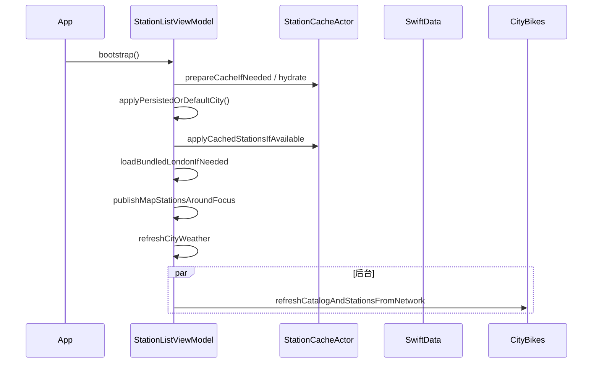

# ADR 001：Urban Mobility Explorer 系统架构

| 元数据 | 值 |
|--------|-----|
| **状态** | Accepted |
| **日期** | 2026-05-19 |
| **决策者** | iOS 工程团队 |
| **关联文档** | [DESIGN.md](../DESIGN.md) · [README.md](../../README.md) |

---

## 1. 背景（Context）

### 1.1 业务目标

构建一款 **城市微出行（共享单车 / 共享滑板车）探索** iOS 应用，作为面向终端用户的产品交付，需满足：

- 站点列表、详情、收藏等完整用户路径；
- **地图优先** 的现代交互，而非传统 Tab 割裂；
- **弱网与离线可用**（地铁、飞行模式等场景仍可浏览缓存数据）；
- **可测试、可扩展** 的分层架构，支持长期迭代与多数据源接入。

### 1.2 约束条件

| 约束 | 说明 |
|------|------|
| 无 API Key | 用户与运维无需配置密钥；数据源开箱即用 |
| iOS 17+ | 采用 SwiftData 做持久化，明确放弃 iOS 16 |
| Swift 6 | 工程默认严格并发检查，领域类型 `Sendable` |
| V1 范围 | 优先交付核心用户路径；ML 推荐、自建后端不在 V1 |

### 1.3 关键用户场景

1. **冷启动**：快速看到默认城市（伦敦）地图与站点，后台刷新 live 数据。
2. **换城**：从全球网络目录选择城市，地图、天气、距离语义立即切换。
3. **Current location**：以设备 GPS 为锚点，逆地理显示城市名，距离按设备计算。
4. **浏览站点**：半屏 / 全屏列表 Sheet，搜索、排序、筛选，选站后地图 Pin 高亮且 Sheet 不意外关闭。
5. **弱网 / 断网**：展示缓存或 Bundled JSON，并标明 `live` / `cache` / `bundled` 数据源。
6. **收藏**：SwiftData 持久化，跨进程重启可读。

---

## 2. 目标与非目标

### 2.1 目标（Goals）

- **G1** 单一地图上下文贯穿发现、列表、详情、选城。
- **G2** 协议边界清晰，ViewModel 不依赖 Alamofire / OpenAPI 生成类型。
- **G3** 三级数据韧性：Live → 内存/SwiftData 缓存 → Bundled JSON。
- **G4** 地图相机、Sheet 高度、FAB 位置可联合计算，避免 magic number 散落各 View。
- **G5** 单元测试覆盖推荐引擎、缓存装饰器、地理工具、DTO 映射、SwiftData 收藏。

### 2.2 非目标（Non-Goals）

- 用户账号 / 登录 / 云同步；
- 实时推送、Widget、Live Activity（列入路线图，非 v1）；
- 自建 GBFS 聚合服务或运营后台；
- 基于 LLM 的推荐或对话式查询；
- 多语言本地化全覆盖（天气建议等部分文案为英文）。

---

## 3. 决策总览（Decision Summary）

采用 **分层整洁架构 + Map-first SwiftUI + 协议驱动数据层**，核心技术选型如下：

| 层级 | 选型 | 理由 |
|------|------|------|
| UI | SwiftUI | 声明式 Sheet / Detent，与地图叠层天然契合 |
| 状态 | `@MainActor` ViewModel + Combine | UI 绑定与搜索防抖 |
| 并发 | async/await、`Task` 取消、`actor` 缓存 | Swift 6 友好 |
| 持久化 | SwiftData | 收藏 + 站点/网络磁盘缓存 |
| 网络 | OpenAPI Generator → SPM `UrbanMobilityNetworking` | 契约稳定、与 UI 解耦 |
| 地图 | MapKit `Map` | 原生性能与 `MKMapItem` 导航 |
| 定位 | `CLLocationManager` 封装 | 授权态可测、可预览 |
| 天气 | Open-Meteo | 无 Key，WMO Code 标准 |

**主数据源**：[CityBikes API](https://api.citybik.es/v2) — 全球共享单车网络与站点余量，JSON 简单、免认证。

---

## 4. 逻辑架构

### 4.1 分层图

```
┌──────────────────────────────────────────────────────────────────┐
│ Presentation                                                      │
│  MapDiscoveryView · MapDiscoveryPanel · Sheets · Components      │
├──────────────────────────────────────────────────────────────────┤
│ Presentation Logic (@MainActor)                                   │
│  StationListViewModel · MapManager · *ViewModel                   │
├──────────────────────────────────────────────────────────────────┤
│ Domain                                                            │
│  MobilityStation · MobilityNetwork · Protocols · Engine           │
├──────────────────────────────────────────────────────────────────┤
│ Data & Infrastructure                                           │
│  Providers · Cache Actor · SwiftData · API Mapping · Location    │
├──────────────────────────────────────────────────────────────────┤
│ UrbanMobilityNetworking (Swift Package)                          │
│  OpenAPI Clients · MobilityAPIBootstrap · Alamofire              │
└──────────────────────────────────────────────────────────────────┘
```

**依赖规则（强制）**：

- 上层可依赖下层；**Domain 不依赖** SwiftUI / SwiftData / Alamofire。
- OpenAPI 生成的 DTO **不得** 泄漏到 ViewModel 公共 API；经 `OpenAPIDomainMapping` 转为 `MobilityStation`。
- 测试通过注入 `StationDataProviding` 替身，不 Mock URLSession 细节。

### 4.2 组合根：`AppDependencies`

`UrbanMobilityExplorerApp` 在 `init` 中配置 `MobilityAPIBootstrap`，并构造 `AppDependencies` 经 `@EnvironmentObject` 注入。

| 依赖 | 默认实现 | 职责 |
|------|----------|------|
| `stationProvider` | `CachedStationDataProvider(live: CityBikes, bundled: JSON)` | 站点/网络获取 |
| `weatherProvider` | `OpenMeteoClient` | 城市天气 |
| `locationService` | `LocationService` | GPS 与授权 |
| `cache` | `StationCacheActor` | 内存 TTL + 写穿 SwiftData |
| `recommendationEngine` | `StationRecommendationEngine` | 启发式评分 |
| `favoritesRepository` | `SwiftDataFavoritesRepository` | 站点收藏 |
| `favoriteNetworksRepository` | `SwiftDataFavoriteNetworksRepository` | 网络收藏 |
| `selectedCityStore` | `SelectedCityStore` (UserDefaults) | 城市 / Current location 选择 |
| `searchHistoryStore` | `SearchHistoryStore` | 搜索历史 |
| `localNetworks` | `LocalNetworksProvider` | Bundled 城市目录 |

`configure(modelContainer:)` 在 SwiftData 容器就绪后注入 Repository，并 **后台 hydrate** 磁盘缓存到 Actor。

---

## 5. 表现层：Map-first 与 Sheet 状态机

### 5.1 导航模型

应用 **无 Tab Bar**。根视图为 `MapDiscoveryView`，结构为：

```
ZStack
├── MapDiscoveryMapView（全屏，常驻）
├── Location FAB（随底部遮挡高度动画）
└── MapTopBar（城市 / 网络名）

.sheet(showDiscoveryPanel) → MapDiscoveryPanel（入口，不可 dismiss）
    └── .sheet(stackedSheet) → 二级流程
```

### 5.2 `MapStackedSheet` 状态枚举

| Case | 用途 | 典型 Detent |
|------|------|-------------|
| `.browseList` | 全网络站点列表 | 半屏 → 全屏可拖 |
| `.favoritesList` | 收藏站点列表 | 同上 |
| `.cityPicker` | 城市 / Current location | 内容自适应 |
| `.secondary(.stationDetail)` | 站点详情 | 内容测量高度 |

**设计决策**：列表选站后 **不** 调用 `dismiss()` 清空 `stackedSheet`。否则 `onChange(of: stackedSheet)` 会置 `selectedStation = nil`，导致地图 Pin 消失。站点 ID 存放在 `detailStation`，`.secondary(.stationDetail)` 不携带 payload，避免切换 Pin 时 Sheet 重建闪烁。

### 5.3 布局指标集中管理

所有 Sheet 高度、圆角、FAB 间距、地图相机 inset 集中在 `MapBottomPanelMetrics` 与 `MapManager.Metrics`：

- `entryPanelHeight`（约 350pt）：发现入口固定高度；
- `fabSpacingAbovePanel`（44pt）：FAB 与 Sheet 顶间距；
- `fabObstructionForBrowseList`：列表拖到全高时 **FAB 不再继续上移**；
- `detailFocusScreenOffset` / `deviceLocationFocusScreenOffset`：相机目标点在屏幕上的额外 Y 偏移。

### 5.4 地图相机

`MapManager` 是唯一相机真相源，对外发布 `MapFocusRequest(region:token:)`。

- **街道级恒定缩放**：约 500m 直径，避免 Sheet 切换时反复 zoom；
- **framing**：`GeoUtilities.region(framing:span:mapSize:topInset:bottomInset:additionalScreenOffsetY:)` 将目标点放入 **可见区域**（扣除顶栏与底部 Sheet）；
- **语义分轨**：
  - `recenter` — 城市 Hub；
  - `focusDeviceLocation` — Current location（额外 Y 偏移）；
  - `focusLikeStationDetail` — 站点详情 Pin 对齐。

`cameraLockKey` 使用 `selectedNetworkId`，防止 Sheet 动画触发重复全图 reframe。

---

## 6. 领域层

### 6.1 核心模型

**`MobilityStation`**：应用内唯一站点真相（`Sendable` struct），字段包括余量、运营态（renting/returning）、深链 `rentalURL`、预计算 `recommendationScore`。

**`MobilityNetwork`**：运营商网络（含 Hub 坐标、城市展示名）。

### 6.2 协议

```swift
protocol StationDataProviding: Sendable {
    func fetchNetworks(forceRefresh: Bool) async throws -> [MobilityNetwork]
    func fetchStations(networkId:forceRefresh:query:) async throws -> StationFetchResult
    func fetchStation(networkId:stationId:) async throws -> MobilityStation?
}

protocol WeatherProviding: Sendable { ... }
protocol FavoritesRepositoryProtocol: Sendable { ... }
```

ViewModel **仅** 依赖协议，便于测试与替换数据源。

### 6.3 推荐引擎

`StationRecommendationEngine`：**纯函数、无 I/O**，总分 0–100：

| 因子 | 权重 | 说明 |
|------|------|------|
| 余量得分 | 40% | `availabilityScore` |
| 车桩平衡 | 20% | bikes / docks 比例 |
| 距离分档 | 25% | &lt;500m … &gt;8km 阶梯 |
| 无定位兜底 | +10 | 无 GPS 时基础分 |

拉取站点批次时写入 `recommendationScore`，列表排序可选「推荐」。

### 6.4 城市锚点 vs 设备 GPS

| 用户选择 | `walkingRouteOrigin` | 天气锚点 | FAB |
|----------|----------------------|----------|-----|
| 已选城市 | 网络 Hub | Hub | `recenter` |
| Current location | 设备 GPS（若授权） | GPS | `focusDeviceLocation` |

避免「显示 London 数据却用巴黎 GPS 算距离」的产品逻辑错误。

---

## 7. 数据层

### 7.1 装饰器：`CachedStationDataProvider`

```
调用方 (ViewModel)
       │
       ▼
CachedStationDataProvider
       ├── live: CityBikesAPIClient
       ├── bundled: LocalBundledStationProvider
       └── cache: StationCacheActor
```

**网络列表 `fetchNetworks`**：

1. 内存缓存 fresh（TTL 默认 5min）→ 返回；
2. Live 成功 → 写入 Actor + SwiftData；
3. Live 失败 → stale 窗口内（默认 1h）返回旧缓存；
4. 否则 → Bundled `networks.json`。

**站点 `fetchStations`**：

1. 内存命中 → 返回（可按 `StationSearchQuery` 客户端过滤）；
2. Live 成功 → 写缓存；
3. Live 失败 → stale 内存 / SwiftData 区域查询；
4. 否则 → Bundled `london_stations.json`（按 networkId）。

返回 `StationFetchResult` 携带 `DataSourceKind`（`live` | `cache` | `bundled`）与 `isStale`，供 UI 提示。

### 7.2 `StationCacheActor`

- **Actor 隔离**所有可变缓存，避免数据竞争；
- **写穿（write-through）** 到 `StationCacheModelActor`（SwiftData）；
- 启动时 `hydrateFromPersistentStore` 一次性加载磁盘；
- `stationsInRegion` 支持 **按地图包围盒** 查询，地图平移不触发 HTTP。

TTL 常量定义于 `APIConfiguration`：`cacheTTL = 300s`，`staleTTL = 3600s`。

### 7.3 SwiftData 模型

| 模型 | 用途 |
|------|------|
| `FavoriteStation` | 收藏站点快照（离线可读） |
| `FavoriteNetwork` | 收藏网络 |
| `CachedStationRecord` | 按网络批量站点 |
| `CachedNetworkRecord` | 网络目录缓存 |

收藏采用 **快照冗余**（复制站点字段），换源后收藏仍可展示，代价是与 live 数据可能短暂不一致。

### 7.4 OpenAPI 与映射

- 规范：`Networking/Scripts/Spec/CityBikeAPI.yaml`、`OpenMeteoAPI.yaml`
- 生成：`Networking/Scripts/generate-openapi-clients.sh` → `OpenApiClientGenerated/`（**禁止手改**）
- 映射：`OpenAPIDomainMapping.swift` 将 DTO → `MobilityStation` / `MobilityNetwork`

### 7.5 离线资源

| 文件 | 作用 |
|------|------|
| `Resources/networks.json` | 城市选择器目录 |
| `Resources/london_stations.json` | 伦敦样本站点（断网兜底） |

---

## 8. 关键流程

### 8.1 冷启动 `bootstrap()`



原则：**先显式后刷新** — 用户立即看到地图与缓存数据，HUD / 状态栏可感知后台更新。

### 8.2 地图视口筛站

- `stations`：当前网络全量（内存）；
- `mapStations`：`GeoUtilities.filter` 按 **可见区域 + 半径** 客户端裁剪；
- `updateVisibleMapRegion`：相机变化时更新；若中心漂移超过 `filterRadiusMeters` 则 **忽略**（防止 Sheet 动画导致错误 region 清空 Pin）；
- 打开 `browseList` / `favoritesList` 时调用 `restoreMapStationsForMapFocus()` 回退 Hub 区域站点。

### 8.3 天气刷新

仅在 `bootstrap()`、`selectCity()`、`selectCurrentLocation()` 触发 `refreshCityWeather()`，**不** 绑定地图 FAB 或相机 onChange，避免无意义 API 调用。

---

## 9. 横切关注点

### 9.1 日志策略

**不在客户端写入日志**（无 `print` / `os.Logger` / 响应体 dump）。错误通过 `LoadState`、本地化文案与缓存降级向用户呈现；避免在日志中泄露位置、站点或 API 载荷。

### 9.2 预览与测试替身

- `AppDependencies.preview()` / `previewForCanvas()` 注入 Bundled Provider；
- `StationListViewModel.previewForCanvas(...)` 支持 Loaded / Loading / Stale 场景；
- `#Preview` 分布在 `MapDiscoveryView`、`RootTabView` 等。

### 9.3 HUD

`ProgressHUD` 用于 Bootstrap 等全局等待；收藏操作用 `FavoriteHUD` 轻提示。

---

## 10. 曾考虑的方案（Alternatives Considered）

| 方案 | 未采用原因 |
|------|------------|
| TabBar（地图 / 列表 / 设置） | 破坏地图连续上下文；Sheet 已足够承载二级流 |
| Core Data | SwiftData 代码量更少，与 SwiftUI 集成更顺 |
| 直接 GBFS 聚合 | 需自建索引与多源适配；CityBikes 已聚合全球网络 |
| `NSCache` | 无结构化并发保证；Actor + 显式 TTL 更清晰 |
| Repository 上帝类 | 装饰器链更易单测、可组合 |
| 服务端推荐 | 超出范围；启发式可解释、可单测 |
| iOS 16 部署 | SwiftData 要求 iOS 17+ |

---

## 11. 权衡（Trade-offs）

| 选择 | 优势 | 代价 | 缓解措施 |
|------|------|------|----------|
| Map-first + 多层 Sheet | 沉浸、地理直觉 | 状态机复杂 | 枚举 `MapStackedSheet` + 集中 Metrics |
| 客户端视口筛站 | 流畅、省流量 | 首次需拉全网络 | 缓存 + 区域 SwiftData 查询 |
| CityBikes | 免 Key、全球 | 字段覆盖不一 | Domain 模型可选字段 + 防御性 UI |
| SwiftData 收藏快照 | 离线可读 | 数据冗余 | 收藏时写入完整快照 |
| Actor 缓存 | 线程安全 | 样板代码 | 单一 `StationCacheActor` 入口 |
| iOS 17+ | 现代 API | 放弃 iOS 16 | ADR 与 README 明确说明 |
| 英文天气建议 | 与 WMO 文档一致 | 非全站 i18n | 可后续 `String Catalog` |

---

## 12. 后果（Consequences）

### 12.1 正面

- 新数据源只需实现 `StationDataProviding` 并接入装饰器链；
- 地图 / Sheet / FAB 行为可预测、可调参位置单一；
- 离线环境可完整走通主路径；
- Swift 6 `Sendable` 边界利于后续 strict concurrency 升级。

### 12.2 负面与风险

- Sheet 嵌套受 SwiftUI 版本行为影响，需真机验证 Detent；
- 大网络（上万站点）全量加载内存压力 — 未来可按 bbox 分页 API；
- OpenAPI 重新生成可能破坏映射 — 需保留 `CityBikesDTOTests`；
- 视频 / 大资源不宜入库 — README 建议使用 `user-attachments`。

---

## 13. 验证（Verification）

### 13.1 自动化

```bash
xcodebuild test \
  -scheme UrbanMobilityExplorer \
  -destination 'platform=iOS Simulator,name=iPhone 16'
```

| 测试套件 | 覆盖点 |
|----------|--------|
| `StationRecommendationEngineTests` | 评分、排序 |
| `CachedStationDataProviderTests` | 降级链 |
| `StationCacheActorTests` / `StationCacheModelActorTests` | TTL、hydrate、区域查询 |
| `FavoritesRepositoryTests` | 收藏持久化 |
| `GeoUtilitiesTests` | 距离、包围盒 |
| `CityBikesDTOTests` | DTO → Domain |
| `SearchHistoryStoreTests` | 历史栈 |

### 13.2 手工检查清单

- [ ] 冷启动：先缓存后刷新，London 默认可见
- [ ] 换城：顶栏城市名、天气、Hub 相机同步
- [ ] Current location：距离相对 GPS
- [ ] 列表选站：Pin 保持，详情 Sheet 打开
- [ ] 列表拖至全屏：FAB 停止上移
- [ ] 断网：Bundled / stale 提示
- [ ] 收藏：杀进程重启仍在
- [ ] 地图 pinch 缩放可用

---

## 14. 相关文件索引

| 主题 | 路径 |
|------|------|
| 地图壳 | `Features/Map/MapDiscoveryView.swift` |
| Sheet 指标 | `Features/Map/MapBottomPanel.swift` |
| 相机 | `Features/Map/MapManager.swift` |
| 主 VM | `Features/Stations/StationListViewModel.swift` |
| 缓存装饰器 | `Data/Providers/CachedStationDataProvider.swift` |
| 缓存 Actor | `Data/Cache/StationCacheActor.swift` |
| 组合根 | `App/AppDependencies.swift` |
| API 配置 | `Core/Networking/APIConfiguration.swift` |
| 地理 | `Core/Geo/GeoUtilities.swift` |
| OpenAPI 生成 | `Networking/Scripts/generate-openapi-clients.sh` |

---

## 15. 修订历史

| 版本 | 日期 | 说明 |
|------|------|------|
| 1.0 | 2026-05-19 | 栈选型、数据源、Sheet 状态机、缓存链、城市语义、流程图、验证清单 |
